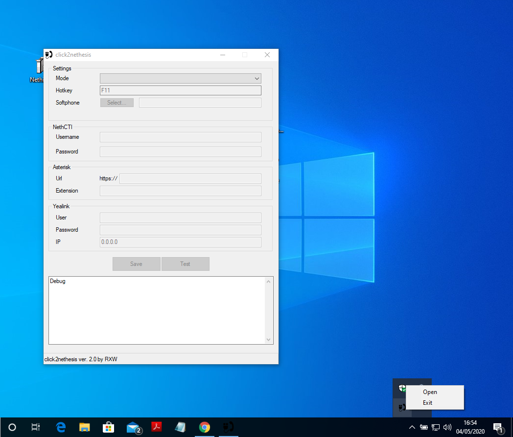
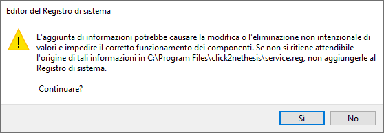
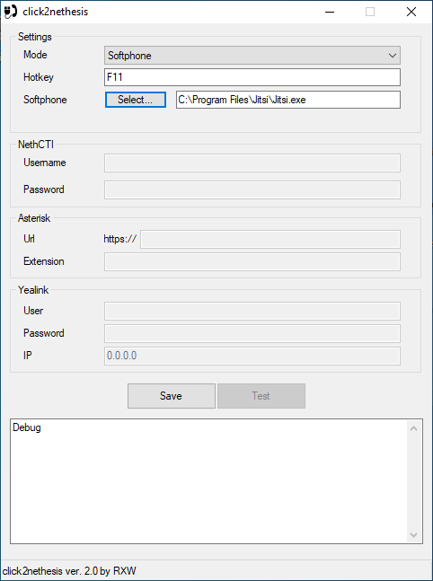
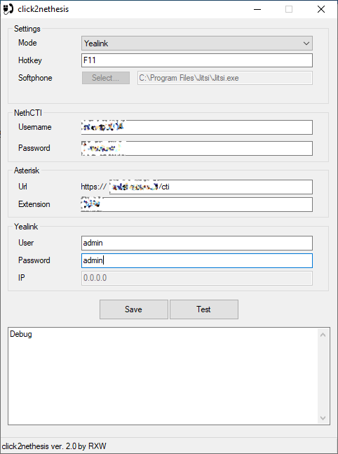

# click2nethesis

click2nethesis è un applicativo creato per gestire la funzionalità di click2call da Windows verso il proprio interno su centralino Nethvoice, tramite softphone o componendo il numero su un telefono Yealink.

*Read this in other languages: [Italian](README.it.md), [English](README.md)*.

## Descrizione
click2nethesis è pensato per semplificare la gestione di una chiamata in uscita da applicativi web o da qualsiasi programma presente sul PC. Può essere invocato utilizzando una URL *sip:* o *sip://* ed implementa inoltre la possibilità di utilizzare un tasto (una *hotkey*) per chiamare direttamente il testo selezionato (se è un numero valido).

Il programma, una volta installato, viene messo in autorun e rimane sempre in esecuzione.

Per visualizzare la GUI di configurazione è possibile cliccare col pulsante destro sulla icona nella taskbar e selezionare "Open".

Il programma è pensato per gestire 3 distinte casistiche:
* interno registrato su un softphone (es. jitsi) installato nel PC
* interno gestito tramite NethCTI (nel browser)
* interno gestito direttamente su telefono fisico Yealink

## Installazione
Il programma può essere installato tramite l'eseguibile presente nella sezione [Releases](https://github.com/frazei/click2nethesis/releases).

Deve essere installato con i diritti di amministratore (click destro sull'installer e poi "Esegui come Amministratore").

Cliccare su "sì" quando viene richiesto di effettuare la modifica al registro di sistema.

Tale modifica del registro va semplicemente ad inserire il programma in autorun e lo associa alle url *sip:*. Qualora un altro programma stia gestendo tali url (es. un softphone) tale modifica andrà a sovrascrivere l'assegnazione precedente. Allo stesso modo se un applicativo che gestisce tale protocollo sarà installato dopo click2nethesis, l'assengazione sarà sovrascritta e si dovrà rieseguire l'assegnazione (vedi la sezione risoluzione problemi).

## Modalità di utilizzo
A seconda della voce scelta dalla select "Mode" sono disponibili 3 modalità. In tutti e tre i casi è possibile specificare una "Hotkey", ovvero un tasto alla cui pressione può essere fatta partire una chiamata al testo (il numero da chiamare) selezionato.

### Softphone

In questo caso è necessario specificare l'eseguibile del softphone (nell'esempio jitsi) da utilizzare per effettuare la chiamata.

In pratica in questo caso il sistema funziona come un *passthrough* permettendo, rispetto all'uso di jitsi da solo, di poter utilizzare anche la funzione di hotkey.

### NethCTI
In questo caso è necessario specificare la username e la password utilizzati per accedere al CTI, la URL del CTI stesso e l'interno dell'utente.

La chiamata potrà quindi essere gestita in due modalità:
* se il CTI web è aperto (in un qualsiasi browser e con lo stesso utente) la chiamata partità da lì;
* se il CTI web è chiuso la chiamata sarà inoltrata al primo dispositivo attivo (per quell'utente) in modalità *predictive*.

### Yealink

In questo caso è necessario specificare, oltre agli stessi parametri della sezione **NethCTI** anche l'utente e la password per accedere al telefono Yealink (di default sono admin/admin).

Da notare che l'indirizzo IP non può essere inserito perchè sarà direttamente l'applicativo a rilevarlo se questo è correttamente registrato sulla centrale.

**Importante: il telefono si deve trovare nella stessa rete del PC.** Il sistema non funziona se il telefono è in una subnet diversa o ha una netmask diversa. Inoltre dovrà essere configurato per accettare le "action URI" dall'indirizzo IP del PC o più genericamente dalla rete in cui si trova il PC, come specificato in queste pagine del supporto Yealink:
* http://support.yealink.com/faq/faqInfo?id=173
* http://support.yealink.com/faq/faqInfo?id=565

## Salvataggio e test della configurazione
Il tasto "SAVE" salva la configurazione in un file ini mentre il tasto "Test" effettua una chiamata di prova e può essere utilizzato per testare le configurazioni "NethCTI" o "Yealink" mentre non funziona per "softphone".

## Risoluzione problemi
L'applicativo salva le sue configurazioni in un file ini che può essere ispezionato in caso di problemi con il salvataggio.
Il file si trova in: `C:\Users\...\AppData\Roaming\click2nethesis.ini`
Nel caso ci siano problemi con la configurazione del registro di Windows (che si occupa dell'autorun dell'applicativo e dell'associazione con la URL **sip:**) è possibile eseguire manualmente la modifica del registro utilizzando i seguenti file: `C:\Program Files\click2nethesis\service.reg` e `C:\Program Files\click2nethesis\service_remove.reg`

## Disinstallazione
Per disinstallare l'applicativo usare l'eseguibile `uninstaller.exe` che si trova nella cartella di installazione del programma `C:\Program Files\click2nethesis`.
Al termine è possibile cancellare la cartella.
