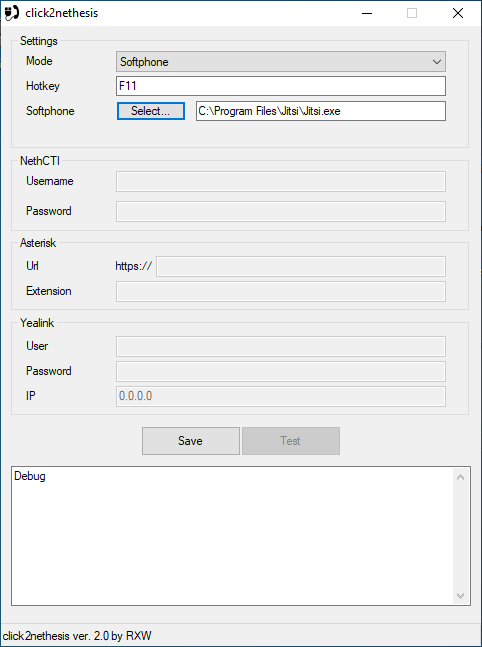
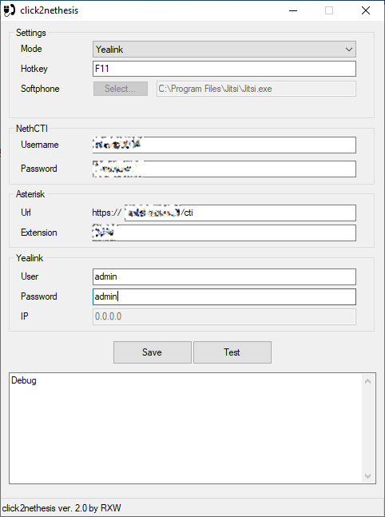

# click2nethesis
 
## descrizione
click2nethesis è un applicativo creato per gestire la funzionalità di click2call da Windows verso il proprio interno su centralino Nethvoice, tramite softphone o direttamente su un telefono fisico Yealink.
Implementa inoltre la possibilità di utilizzare un tasto (una *hotkey*) per chiamare direttamente il testo selezionato (se è un numero valido).

Il programma, una volta installato, viene messo in autorun e rimane sempre in esecuzione.

Per visualizzare la GUI è necessario cliccare col pulsante destro sulla icona nella taskbar e selezionare "Open".

Il programma è pensato per gestire 3 distinte casistiche:
* interno registrato su un softphone (es. jitsi) installato nel PC
* interno gestito tramite NethCTI (nel browser)
* interno gestito direttamente su telefono fisico Yealink

## installazione
Il programma può essere installato tramite l'eseguibile presente nella sezione [Releases](https://github.com/frazei/click2nethesis/releases).
	
Deve essere installato con i diritti di amministratore (click destro sull'installer e poi "Esegui come Amministratore").
 
Cliccare su "sì" quando viene richiesto di effettuare la modifica al registro di sistema.
	

	
Tale modifica va ad inserire il programma in autorun e lo associa alle url *sip://*
	
## softphone

La configurazione richiede di specificare l'eseguibile del softphone utilizzato (nell'esempio jitsi) che deve essere configurato.

In pratica in questo caso il sistema funziona come un *passthrough* permettendo, rispetto all'uso di jitsi da solo, di utilizzare la funzione di hotkey.

## nethCTI
La configurazione richiede di specificare la username e la password utilizzati per accedere al CTI oltre che la URL del CTI stesso e l'interno dell'utente.

La chiamata potrà quindi essere gestita in due modalità:
* se il CTI web è aperto (in un qualsiasi browser e con lo stesso utente) la chiamata partità da lì
* se il CTI web è chiuso la chiamata sarà inoltrata al primo dispositivo attivo (per quell'utente) in modalità *predictive*

## Yealink

La configurazione richiede, oltre agli stessi parametri della sezione **nethCTI** anche l'utente e la password per accedere al telefono Yealink.

Da notare che l'indirizzo IP non può essere inserito perchè sarà direttamente l'applicativo a rilevarlo se questo è stato registrato sulla centrale.

**Importante: il telefono si deve trovare nella stessa rete del PC.** Il sistema non funziona se il telefono è in una subnet diversa o ha una netmask diversa. Inoltre dovrà essere configurato per accettare le "action URI" dall'indirizzo IP del PC o più genericamente dalla rete in cui si trova il PC, come specificato in queste pagine del supporto Yealink:
* http://support.yealink.com/faq/faqInfo?id=173
* http://support.yealink.com/faq/faqInfo?id=565

## salvataggio e test della configurazione
Il tasto "SAVE" salva la configurazione in un file ini mentre il tasto "Test" effettua una chiamata di prova e può essere utilizzato per testare le configurazioni "nethCTI" o "yealink" mentre non funziona per "softphone".
